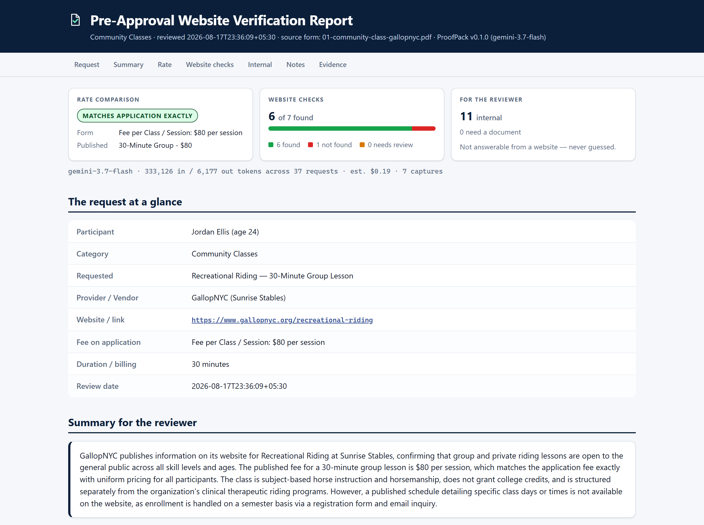
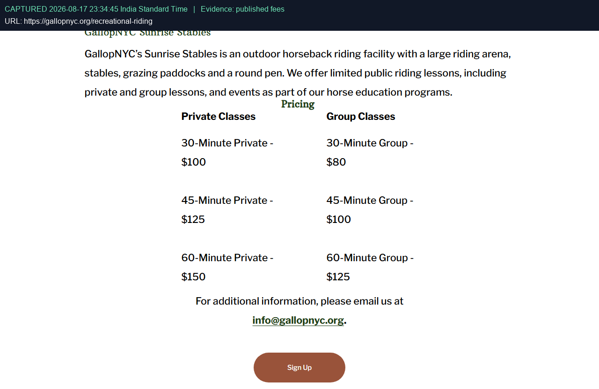
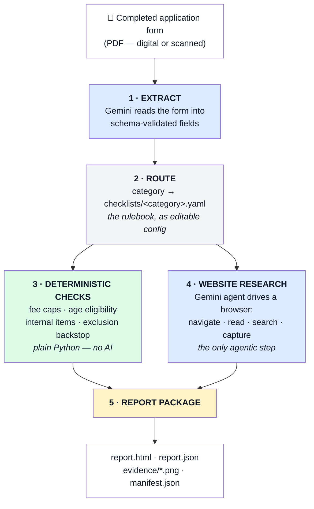
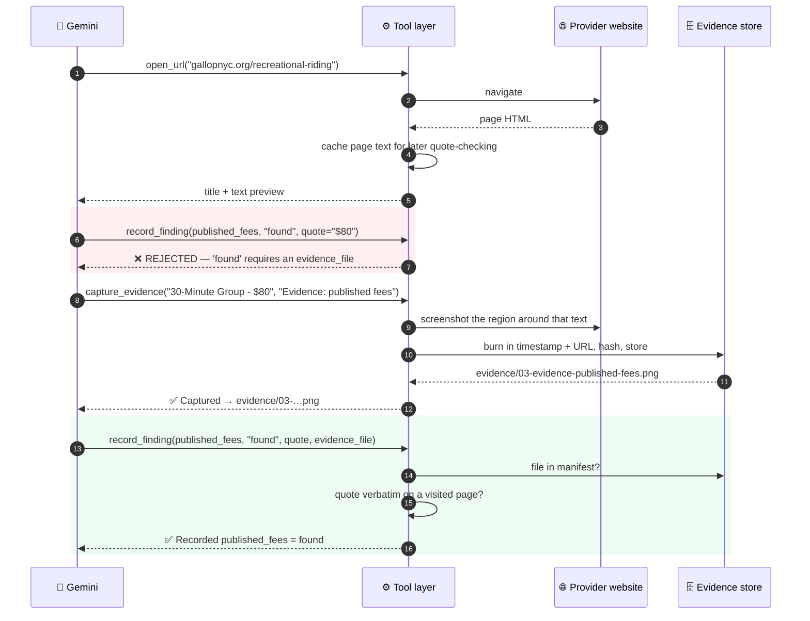
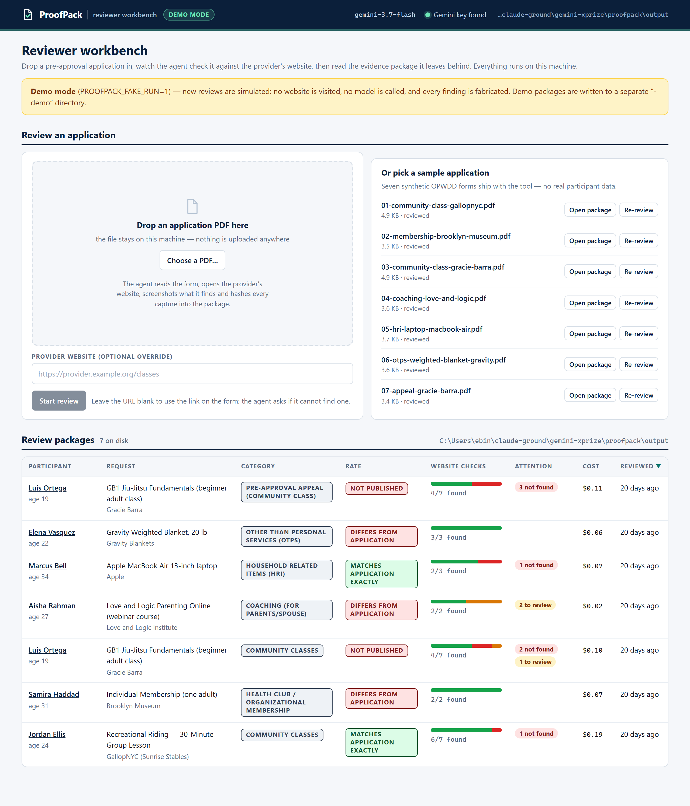
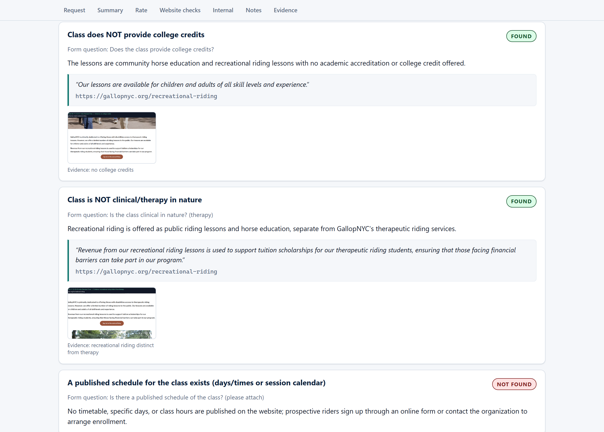
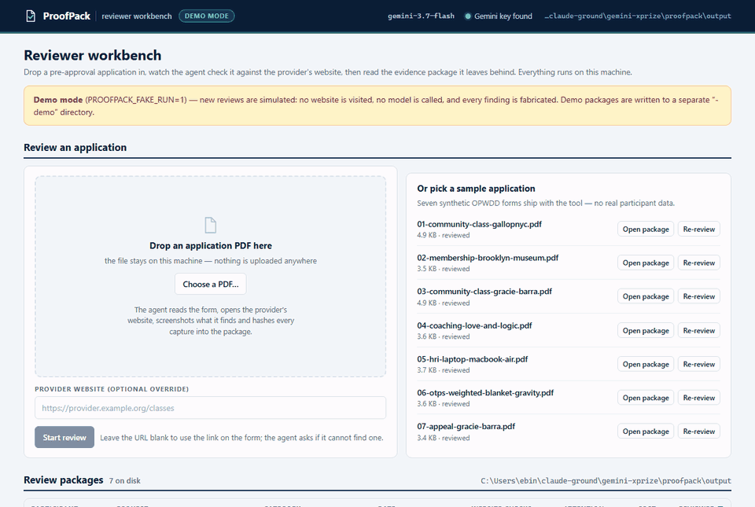
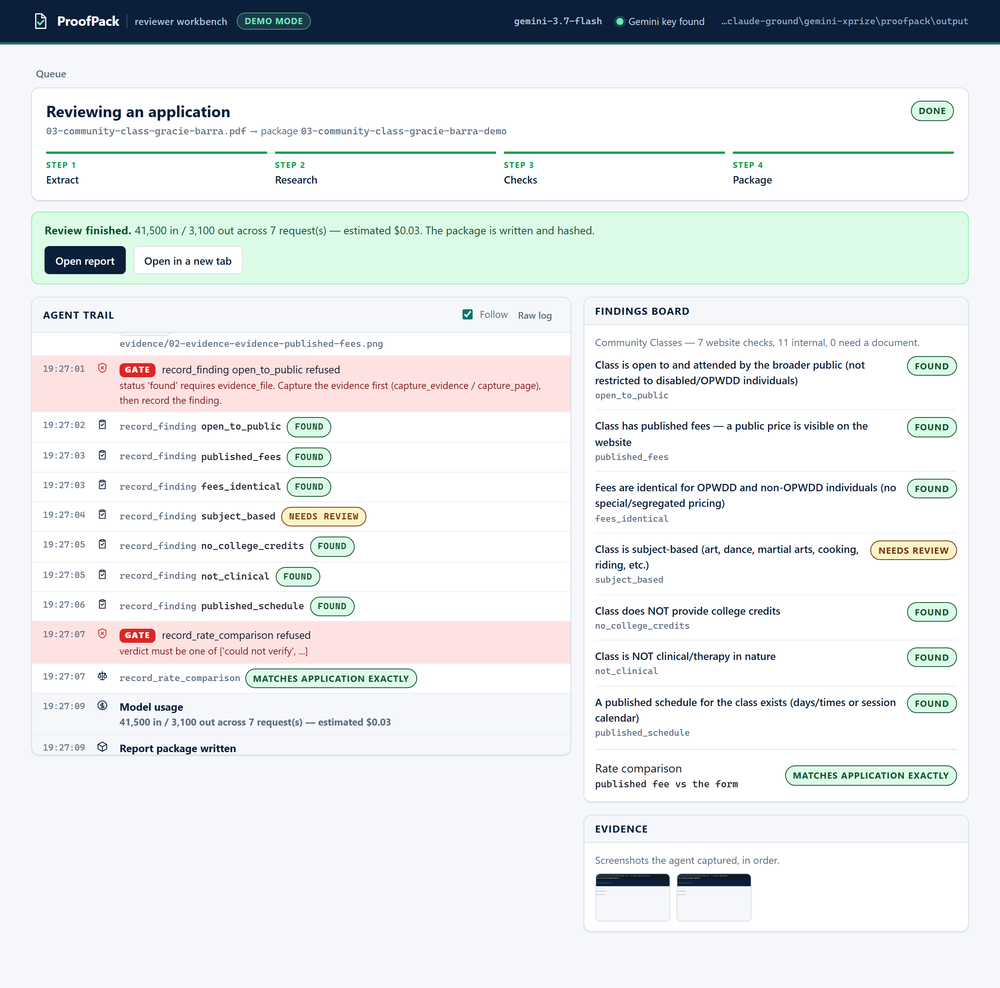
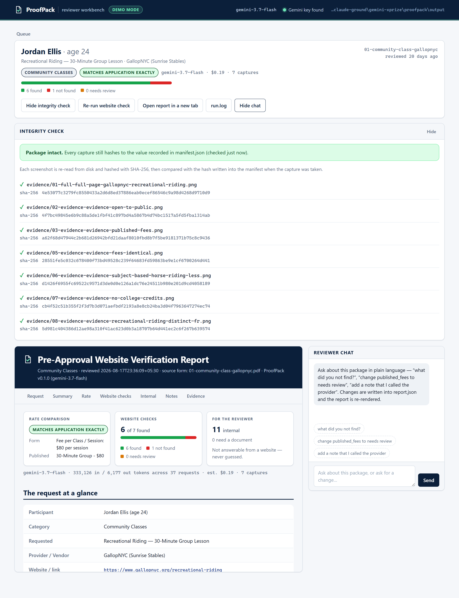

# ProofPack

[](https://github.com/ebt55/proofpack/actions/workflows/tests.yml)
[](LICENSE)
[](requirements.txt)
[](https://ai.google.dev/)

**The AI pre-approval reviewer that brings the receipts.**

ProofPack is an AI agent that does a compliance reviewer's website research — and produces
evidence that holds up in a government audit. Give it a completed pre-approval application form
(PDF). It reads the form, visits the provider's public website, checks the things a website can
actually prove, captures date-stamped screenshot evidence, and hands back a review-ready report.

A human always makes the final approve/deny decision. The tool never guesses: when the web
can't prove something, it says **"Not Found"** or **"Needs Review"** — and that is a correct
answer, not a failure.

Runs on the **Gemini API** (`gemini-3.7-flash`) for form reading, the browsing agent and the
reviewer chat; everything that touches evidence is deterministic Python.

---

## The 30-second version

A form arrives saying: *"Jordan E. wants a 30-minute group riding lesson at GallopNYC, $80 per
session, gallopnyc.org/recreational-riding."*

One command later:

```bash
python verify.py review samples/01-community-class-gallopnyc.pdf
```



The agent found GallopNYC's public rate table, confirmed **$80 matches the application
exactly**, verified the class is open to the general public and isn't clinical therapy — and
honestly reported that **no published schedule exists**, because none does. Every "Found" is
backed by a screenshot like this, with the capture time and URL burned into the image:



That review cost **$0.19 of Gemini** and a few minutes of wall-clock; a reviewer doing it by hand
budgets 20–40 minutes per application.

**Contents**
[The problem](#the-problem-in-plain-english) ·
[Who pays](#who-pays-and-why) ·
[What it does](#what-the-tool-does) ·
[The crux](#the-crux-what-a-website-can-and-cant-prove) ·
[Keeping the agent honest](#keeping-the-agent-honest) ·
[Architecture](#architecture--stack) ·
[Quickstart](#quickstart) ·
[Output](#the-output-package) ·
[Workbench](#the-reviewer-workbench) ·
[Adding a form type](#adding-a-new-form-type) ·
[Validation](#how-it-was-validated) ·
[Limitations](#limitations--known-gaps)

---

## The problem, in plain English

**Who uses this:** a **Pre-Approvals Reviewer** at a non-profit that administers budgets for
people with developmental disabilities — in New York, a *Fiscal Intermediary* (FI) in the
OPWDD Self-Direction program.

**Why the job exists:** in Self-Direction, a participant controls their own government-funded
budget. Before they can spend it on something non-routine — a riding class, a gym membership, a
grab bar — staff must confirm the purchase qualifies under Medicaid rules. A recurring rule is
that the thing must be **genuinely public**: open to everyone, at a **publicly published price** —
not a special rate invented for disabled participants.

**Why it's painful:** Medicaid **audits** these purchases. If the agency approves something
that didn't qualify, the money gets clawed back. So the cleanest proof is: go to the
provider's website, show the class and its price are really there, and **save date-stamped
screenshots for the audit file**. Today a reviewer does this by hand, one site at a time —
slow, repetitive, and inconsistent between reviewers.

**What ProofPack does about it:** the reading, the research and the evidence-gathering, in one
pass — leaving the reviewer to do the judging.

<details>
<summary><b>Domain glossary</b> (click to expand — everything you need to read the code)</summary>

| Term | Plain meaning |
|---|---|
| **OPWDD** | NY State Office for People With Developmental Disabilities — funds and regulates the program |
| **Self-Direction** | Program where the participant controls their own government-funded budget |
| **Participant** | The person with a developmental disability receiving services |
| **FI (Fiscal Intermediary)** | The agency that holds the budget and enforces the spending rules — the customer |
| **Pre-approval** | Required sign-off *before* budget money is spent on a non-routine item — the process this tool serves |
| **Pre-Approvals Reviewer** | The staff member who does that sign-off — **the user of this tool** |
| **Life Plan (LP)** | The participant's official care plan; internal, never on any website |
| **HRI / OTPS** | Household Related Items / Other Than Personal Services — two budget categories with their own forms, caps and exclusion lists |
| **Exclusion list** | Item categories the program will not fund (e.g. computer hardware, cable TV) |

</details>

---

## Who pays, and why

ProofPack is B2B software for the agencies that run self-directed budgets — Fiscal
Intermediaries in New York today; Medicaid HCBS self-direction programs exist in most US states
and follow the same "publicly available at a published price" logic.

| | |
|---|---|
| **Customer** | Fiscal Intermediaries / support brokerage agencies (small non-profits, typically 5–50 reviewers) |
| **Value** | Reviewer time (20–40 min → ~3 min per application), consistency between reviewers, and an audit file that defends every approval with stamped evidence |
| **Pricing** | Per review (target **$3 per application**, ~25× the model cost) or **$149 per reviewer seat per month**; pilots run free on 20 anonymized forms |
| **Cost to serve** | $0.02–$0.19 of Gemini per review today (measured across seven committed runs, see the [validation table](#how-it-was-validated)); the rest is commodity compute |
| **AI-native operations** | The agent decides which pages to visit, whether each requirement is met and what to tell the reviewer; Python decides what it is *allowed* to claim. Every decision is logged (`run.log`) and every claim is hashed |

Full model, market sizing, impact metrics and pilot plan: **[docs/BUSINESS.md](docs/BUSINESS.md)**.
Status: working product, no paying customers yet — see the pilot offer in that document.

---

## What the tool does

Five stages. Only **one** of them is open-ended AI work; the rest is ordinary, predictable code.



<sub>🔵 blue = Gemini does the judging · 🟢 green = deterministic Python · 🟡 yellow = output</sub>

---

## The crux: what a website *can* and *can't* prove

This is the heart of the project, and the thing most likely to be done wrong.

Every form carries 6–18 YES/NO questions. **A website can only answer some of them.** The rest
depend on internal records — whether the category is in the participant's budget, whether it
matches a goal in their Life Plan, whether it duplicates a service they already receive.

An AI tool that cheerfully answers all 18 is worse than useless: it produces confident,
unfounded claims into an audit file. So every checklist item is classified in config, and the
tool only ever answers the first kind:

| Kind | Who answers it | How it appears in the report |
|---|---|---|
| `website` | The research agent — **with mandatory screenshot evidence** | Found / Not Found / Needs Review |
| `internal` | **Nobody.** Deliberately left alone | *"Internal — not website-verifiable"*, with the reason |
| `document` | Nobody — needs paperwork (e.g. a staff-screening letter) | *"Needs Document"* |

Concretely, for a Community Class application:

| Form question | Verdict |
|---|---|
| Is the class open to and attended by the broader public? | ✅ **website** |
| Does the class have published fees? | ✅ **website** |
| Are fees identical for OPWDD and non-OPWDD individuals? | ✅ **website** |
| Is the class subject-based (art, dance, martial arts…)? | ✅ **website** |
| Does the class provide college credits? | ✅ **website** |
| Is the class clinical in nature (therapy)? | ✅ **website** |
| Is there a published schedule? | ✅ **website** |
| Are community classes currently approved in the budget? | 🔒 internal — budget system |
| Does the class match a goal in the Life Plan? | 🔒 internal — care plan |
| Does it duplicate Medicaid/HCBS waiver services? | 🔒 internal — service records |
| …and 8 more | 🔒 internal |

The reviewer opens the report and immediately sees which 7 questions are answered with
evidence, and which 11 are still theirs to do — spelled out, not silently omitted.

---

## Keeping the agent honest

> **The model decides. Deterministic code produces the evidence.**

An LLM given a screenshot tool will happily *claim* it captured something. In an audit
context, a fabricated "verified" is the single worst output the system can produce — far worse
than "I couldn't check this." So the tool doesn't rely on the model behaving: the tool layer
**refuses** malformed claims.

### The three gates

| # | Gate | Enforced by |
|---|---|---|
| 1 | A finding can't be **"Found"** without citing an evidence file that **exists in the manifest** | `record_finding()` rejects the call and tells the model why |
| 2 | A quote must appear **verbatim** in the text of a page the agent **actually visited this session** | Session keeps every page's text; quote is substring-checked before acceptance |
| 3 | Timestamps, URLs and SHA-256 hashes are **never written by the model** | The evidence store stamps and hashes every capture in Python |

Plus two safety nets: **internal items never reach the model at all** (the pipeline fills them
in directly), and an **exclusion-keyword backstop** independently re-checks category
exclusions — so a laptop on a household-items form gets flagged even if the agent misses it.

### What a rejection actually looks like

The agent tries to shortcut; the tool layer stops it and it self-corrects:



### Who is responsible for what

| Decision / artifact | Gemini | Python |
|---|:---:|:---:|
| Which page is likely to hold the proof | ✅ | |
| Whether the page text satisfies the requirement | ✅ | |
| Plain-language notes and the reviewer summary | ✅ | |
| Whether a claimed finding is *allowed to be recorded* | | ✅ |
| Taking the screenshot, stamping time + URL | | ✅ |
| SHA-256 hashes and the manifest | | ✅ |
| Fee-cap arithmetic, age eligibility | | ✅ |
| Marking items internal / needs-document | | ✅ |
| Exclusion-list backstop | | ✅ |

Because the gates live on the session object rather than inside the tool closures, **every
rejection path is unit-tested** without an API key or a browser —
[`tests/test_agent_gates.py`](tests/test_agent_gates.py) asserts that a fabricated quote, a
missing capture, an invented evidence filename and an attempt to answer an *internal* item are
all refused, and that honest negatives are never harder to record than positives.

The result: **you can verify the tool's honesty without trusting the tool.** Every package ships
with hashes and the agent's full action trail (`run.log`), and
[`tests/test_audit_packages.py`](tests/test_audit_packages.py) re-checks the invariants across
all committed reports — any "Found" whose evidence is missing or altered fails the audit.

---

## Architecture & stack

```mermaid
flowchart LR
    subgraph cli["🖥️ Interface"]
        R["cli.py<br/><i>review · review-all · render</i>"]
        CH["chat.py — plain-language edits"]
        SV["server.py + jobs.py<br/><i>workbench: FastAPI · SSE</i>"]
    end

    subgraph orch["🧩 Orchestration — pipeline.py"]
        P1["deterministic checks"]
        P2["package assembly"]
    end

    subgraph ai["🧠 Judgment — Gemini 3.7 Flash"]
        X["extraction.py<br/><i>PDF → structured fields</i>"]
        AG["agent.py + llm.py<br/><i>function-calling research loop</i>"]
    end

    subgraph det["⚙️ Deterministic layer"]
        BR["browser.py<br/><i>Playwright</i>"]
        EV["evidence.py<br/><i>stamp · hash · manifest</i>"]
        RP["report.py<br/><i>Jinja2 → HTML/JSON</i>"]
    end

    cfg["📋 <b>checklists/*.yaml</b><br/>7 categories<br/>website vs internal items<br/>fee caps · exclusions · hints"]

    cli --> orch
    orch --> ai
    orch --> det
    ai -->|"tool calls"| det
    cfg -.->|"rules drive<br/>both sides"| orch
    cfg -.-> ai

    style ai fill:#dbeafe,color:#111827
    style det fill:#dcfce7,color:#111827
    style cfg fill:#f3f4f6,color:#111827
    style orch fill:#fef3c7,color:#111827
    style cli fill:#ffffff,color:#111827
```



### Stack choices, and why

| Choice | Why this and not the alternative |
|---|---|
| **Gemini API + `google-genai` function calling** — *not* LangGraph/CrewAI | The pipeline is linear with exactly **one** agentic step. A framework would add a dependency and hide the loop; ~60 lines in [`llm.py`](preapproval/llm.py) run the tool loop with automatic function calling *disabled*, so this code — not the SDK — executes every call and can refuse it. |
| **Gemini 3.7 Flash** (swap in `config.yaml`) | Strong judgment on the genuinely hard calls (*is a "contact us for pricing" page a published fee?*) at Flash cost: the seven committed reviews cost **$0.02–$0.19 each**. Any Gemini model id works. |
| **Gemini PDF understanding + JSON response schema** for the form | Scanned and digital forms parse the same way — no brittle text-position rules — and the result is a **schema-validated object**, not free text to regex. |
| **Playwright** | The evidence requirement picks the tool: full-page captures, region captures around located text, and JS-rendered pages. Selenium is clunkier here; HTTP+BeautifulSoup can't screenshot at all. |
| **YAML checklists** | The form → checklist → verifiable-subset mapping is **domain knowledge, not code**. A non-engineer can add a category or change an agency's caps. See [docs/ADDING-A-CHECKLIST.md](docs/ADDING-A-CHECKLIST.md). |
| **FastAPI + server-sent events + vanilla JS** for the workbench — *not* a SPA framework | The workbench is one page with three views over a JSON API; the interesting part is a one-way stream of log lines, which SSE does in a few lines over plain HTTP. A build step and a framework would add hundreds of dependencies to a tool whose whole pitch is "few moving parts around the model" — and the report, the artifact that matters, has to stay dependency-free anyway. |
| **Local workbench + self-contained HTML report** — not a hosted app (yet) | The reviewer's artifact is the **report**: it opens in any browser, prints for the audit file and needs no server. `serve` now wraps the pipeline in a localhost UI so a reviewer can drop in a PDF and watch the work, while the CLI still makes batch validation (`review-all`) trivial. What's missing before hosting is authentication and PHI-safe storage, not screens (see [docs/KNOWN-GAPS.md](docs/KNOWN-GAPS.md) and [docs/BUSINESS.md](docs/BUSINESS.md)). |

---

## Quickstart

**You need:** Python 3.11+, a [Gemini API key](https://aistudio.google.com/apikey), internet access.

```bash
# 1 · Install (one time)
python -m venv .venv
.venv/bin/python -m pip install -r requirements.txt      # Windows: .\.venv\Scripts\python
.venv/bin/python -m playwright install chromium

# 2 · Add your API key (one time)
cp .env.example .env        # Windows: copy .env.example .env
#   …then paste your key into .env as GEMINI_API_KEY=...

# 3 · Open the reviewer workbench
.venv/bin/python verify.py serve            # → http://127.0.0.1:8765
```



Drop an application PDF on the page (or pick one of the samples), watch the agent work live,
then open the finished package. The workbench binds to **127.0.0.1 only** and has no login — a
local tool, not a hosted service. More on it below and in **[docs/WORKBENCH.md](docs/WORKBENCH.md)**.

No key yet? `PROOFPACK_FAKE_RUN=1 python verify.py serve` walks the same interface on a scripted
demo review — no website, no model, no cost.

Prefer the terminal? The same review is one command, and always has been:

```bash
.venv/bin/python verify.py review samples/01-community-class-gallopnyc.pdf
```

Either way the tool writes a package under `output/`; open its `report.html`. A run takes a few
minutes, and the tool reports its own token use and estimated cost when it finishes.

> **Nothing to run yet?** Every sample in this repo has already been reviewed and committed —
> start `serve` and open any package from the queue, or open an `output/*/report.html`
> [directly in a browser](output/).

**Other commands**

```bash
verify.py review-all                       # run every form in samples/
verify.py review <pdf> --headed            # watch the browser work (also beats some bot checks)
verify.py review <pdf> --url https://...   # supply or override the provider URL
verify.py chat output/<package>            # adjust a finished report in plain language
verify.py serve --host 127.0.0.1 --port 8765 --out output --model <id> --headed --open
                                           # the workbench; --open launches your browser
verify.py render output/<package> …        # re-render report.html from report.json
verify.py render --all                     # …for every package in the output directory
python tools/make_sample_forms.py          # regenerate the synthetic sample forms
```

**Chat mode** lets the reviewer talk to a finished report — on the command line, or in the
workbench's chat panel: *"change published_fees to needs review"*, *"add a note that I called
the provider"*, *"re-run the website check"*, *"regenerate the report"*. Edits are recorded as **reviewer overrides** (never silently
rewritten as agent findings) and the HTML is re-rendered on the spot. A re-run visits the site
again and refreshes the findings and evidence, keeping your notes — useful when a page was
temporarily blocked or the provider updated their site.

---

## The output package

```
output/01-community-class-gallopnyc/
├── report.html      ← the review-ready report (open this)
├── report.json      ← same content, machine-readable
├── manifest.json    ← SHA-256 hash of every capture, for integrity checking
├── run.log          ← the agent's full action trail for this review
└── evidence/
    ├── 01-full-…png       whole-page capture — "here is the site we reviewed"
    ├── 02-evidence-…png   one targeted capture per confirmed requirement
    └── …
```

**The report contains:**

- **The request at a glance** — participant, category, item, provider, link, fee, review date
- **Summary for the reviewer** — a few sentences: what was verified, what wasn't, what needs attention
- **Rate comparison** — application fee vs. published fee, with a plain verdict
  (*matches exactly / differs / not published / could not verify*)
- **Website verification** — per item: status, plain-language note, **verbatim quote**, URL, evidence links
- **Form-level checks** — deterministic pass/flag: fee caps, adults-only age
- **Requires a document** — items proven by paperwork, not the web
- **Internal items** — everything the website can't answer, listed explicitly and never guessed
- **Evidence appendix** — every capture inline, with timestamps and hashes

It opens with a **verdict strip** — rate verdict, website checks as an "N of M found" bar, form
checks, and what is left for the reviewer — so the answer is visible before any scrolling. Each
finding carries its evidence as thumbnails; clicking one opens a **lightbox** with that
capture's label, URL, capture time and full SHA-256. The file stays self-contained: no network,
no build step, and it prints for the audit file.



---

## The reviewer workbench

`python verify.py serve` puts the same pipeline behind a local web page, so a reviewer never
has to touch a terminal after setup.



Recorded in demo mode (`PROOFPACK_FAKE_RUN=1`), so the run is scripted — no website is visited
and no model is called — while the trail, the gates and the findings board are the real ones.

Three views:

| View | What it does |
|---|---|
| **Queue** | Drag in an application PDF (or pick a sample — already-reviewed ones offer **Open package** and **Re-review**), see the jobs in flight, and browse every finished package in a sortable table — participant, category, rate verdict, a found / not-found bar, warnings and the run's cost |
| **Run** | The live agent trail, streamed while the review happens: every page opened, every search, every capture (with thumbnails), every finding as it lands — beside a findings board that flips each checklist item from *pending* to its status, and an evidence strip. If the form has no usable URL the run pauses and asks |
| **Package** | The finished report in a frame, plus **Verify integrity** (re-hashes every capture against the manifest on demand), the raw `run.log`, a re-run button, a link that opens the report in its own tab, and the plain-language reviewer chat beside it |



The run view is where the honesty machinery becomes visible: when the tool layer refuses a
claim — a "Found" with no capture, a quote that isn't on any page the agent read — the trail
shows a red **GATE** row with the reason, followed by the agent correcting itself. That is the
same rejection path [`tests/test_agent_gates.py`](tests/test_agent_gates.py) asserts, only
watchable.



**Without an API key**, the workbench still opens every committed package, verifies integrity
and shows the reports; set `PROOFPACK_FAKE_RUN=1` before `serve` to walk the whole interface on
a scripted demo review that visits no website, calls no model and writes its output to a
separate `<slug>-demo` package.

**It is localhost software.** It binds to `127.0.0.1`, has **no authentication**, and serves
report packages that in production would contain participant names (PHI) — so don't put it on a
network. Hosting it is the next step, and it needs auth first: see
[docs/KNOWN-GAPS.md](docs/KNOWN-GAPS.md). Full tour, HTTP API and security notes:
**[docs/WORKBENCH.md](docs/WORKBENCH.md)**.

---

## Adding a new form type

The rulebook is config. A new category is a **new YAML file** — no pipeline changes:

```yaml
category: art_supplies
display_name: Art Supplies
adults_only: false
fee_caps:
  - id: cap_budget_year
    label: "Capped at $500 per budget year"
    max_amount: 500
    unit_keywords: []
items:
  - id: published_fees
    form_question: "Does the item have published fees?"
    requirement: "A public price for the item is visible"
    kind: website                       # website | internal | document
    check_hint: >
      Find a public dollar price. "Contact us for pricing" is NOT a published fee.
  - id: budget_approved
    form_question: "Is this category approved in the budget?"
    kind: internal
    internal_reason: "Budget data lives in internal systems."
```

Full guide, including the one-line code registration and the rule of thumb for classifying
items: **[docs/ADDING-A-CHECKLIST.md](docs/ADDING-A-CHECKLIST.md)**. Fee caps and exclusion
lists are per-agency settings; the shipped defaults follow commonly published NY Self-Direction
guidance.

---

## How it was validated

"The agent said it worked" is not validation. Four independent layers, none of which take the
agent's word for anything:

**1 · Unit tests (87, no API key, browser or network needed)** — every integrity-gate rejection
path (fabricated quote, missing capture, invented filename, internal item); the YAML configs
(website/internal split, fee caps, exclusion lists); fee-cap and age logic; the clarification
rules; evidence stamping/hashing; report rendering; the job queue's full state machine
(queued → running → needs input → done, plus skip and failure) against a stubbed pipeline; and
the workbench API, including that a path-traversal request for a file outside a package is
refused. Plus the one that matters most: **tampering with a capture is detectable** against the
manifest. They run in CI on Python 3.11–3.13.

```bash
.venv/bin/python -m pytest tests/
```

**2 · A re-runnable integrity audit** over every produced package, in both directions — every
"Found" cites a capture that exists and still hashes correctly, *and* no capture sits on disk
without a manifest entry. Anyone can re-run it:

```bash
.venv/bin/python tests/test_audit_packages.py
# → 7 package(s) audited, 0 with problems.
```

**3 · Human ground-truthing** — the same provider sites were opened in a normal browser to
confirm the tool's **negatives were true negatives**: Gracie Barra genuinely publishes no
prices on its class pages, GallopNYC genuinely publishes no schedule, Love and Logic really
lists the course at $125, Gravity really shows a $149 sale price against a $199 list price. An
honest tool has to be right about *absence* and about *differences*, and only a human check can
confirm that.

**4 · The sample set spans the outcomes that matter.** The seven synthetic forms in
[`samples/`](samples/) (fictional participants, real public providers; regenerate with
`tools/make_sample_forms.py`) were chosen to exercise a clean match, price discrepancies, an
exclusion-list trap, an appeal, and honest negatives — across six of the seven form types:

| # | Sample | Result | Why that's correct | Cost |
|---|---|---|---|---|
| 01 | GallopNYC group riding (community class) | 6 verified · schedule Not Found · **rate matches exactly** | Public rate table exists; no schedule is published | $0.19 |
| 02 | Brooklyn Museum membership | Open to public + fee published · **rate differs** ($80 published vs $85 on the form) | Real price exists and doesn't match the form's figure — the reviewer should see that | $0.07 |
| 03 | Gracie Barra GB1 fundamentals (community class) | Public & subject-based verified · **fees Not Found** · rate *not published* | The class page genuinely publishes no prices; the tool refuses to guess one | $0.10 |
| 04 | Love and Logic parenting course (coaching) | Fees + educational content verified · **rate differs** ($125 published vs $150 on the form) · $500/yr cap **pass** · adults-only **pass** | The published price is real and lower than the form's — a pricing discrepancy the reviewer must resolve | $0.02 |
| 05 | **MacBook Air (HRI — the trap)** | Price verified, matches · **not_excluded = Not Found** — *"computer hardware is an explicitly excluded category"* · $1,500 cap pass | The item is real and correctly priced, and still not fundable: the agent flagged the exclusion itself | $0.07 |
| 06 | Gravity weighted blanket (OTPS) | Item, price and all claimed safety features verified · **rate differs** — *"$149.00 (regularly $199.00)"* | The form quotes list price; the site is running a sale — exactly the nuance a reviewer wants surfaced | $0.06 |
| 07 | **Appeal** — Gracie Barra denial | Re-checked with priority on the denial reason: fees still **Not Found**, schedule Not Found; the phone-confirmed rate is not on the website | The denial reason was "fees could not be verified" — and they still can't; the evidence supports the original denial | $0.11 |

Costs are the tool's own estimate from Gemini's token counts at Flash list prices. Not
covered live: the transition-program form (the CUNY continuing-education sites timed out
from our network during testing) — its checklist and caps are unit-tested but no package is
committed yet.

---

## Limitations & known gaps

Honest and specific — the full engineering audit, with what to do next and in what order, is
in **[docs/KNOWN-GAPS.md](docs/KNOWN-GAPS.md)**. The headlines:

- **Dead links & bot-protected sites.** Retailers may CAPTCHA automated browsers; some sites time
  out. The tool detects non-content pages, never treats them as evidence, and reports *Needs
  Review* with a capture of what it saw. `--headed` often gets through where headless doesn't;
  `--url` swaps in a current link. **This is designed behaviour, not a failure mode.**
- **Location-gated pricing** (gyms that need a club selected first) → *Needs Review* with the
  gate captured. The tool won't pick a location the applicant didn't state.
- **Provider price sheets published as PDFs can't be read** — Playwright gets no text from a
  PDF URL, so a linked price list is invisible to the agent. A real provider pattern, and the
  top item on the next-steps list (Gemini reads PDFs natively, so this is plumbing, not research).
- **The rate comparison is model-authored prose, not arithmetic** — no automatic handling of
  "$80" vs "$80.00 + tax". Making it structured would move one more judgment into code.
- **One review = one provider site**, by design — the agent won't "research around" a missing
  fact on third-party sites.
- **Fee caps are checked per form**; cumulative annual spend needs internal data.
- Evidence reflects the site **at review time** — which is exactly what the date stamps are for.

### Production readiness & privacy (PHI)

A working prototype. Production would need:

- **PHI handling.** Real applications carry participant names and ages. This prototype runs on
  synthetic data only. In production: **redact participant identity before any third-party API
  call** — the website checks never need the participant's name, only the item, provider and
  fee — plus a paid-tier API agreement (no training on inputs) and access-controlled storage
  with retention rules.
- **An anti-bot strategy** for retail links: a licensed product-data API or an allow-listed
  capture service instead of scraping.
- **Auth + queue integration.** The local workbench is deliberately single-user and has no
  login; a hosted one needs sign-in, per-agency isolation, and intake from a watched
  Drive/SharePoint folder or an API — with an audit log of reviewer overrides.
- **Observability**: per-run token/cost accounting (already in every report), failure alerting,
  and periodic spot-checks of "Found" findings against their captures — cheap, because of the hashes.
- **Model pinning + a golden-set regression suite** before any model upgrade. The samples are
  the beginning of one.

---

## Repo map

```
verify.py                 entry point — review / review-all / chat / serve / render
preapproval/
  llm.py                  Gemini client + the function-calling loop (AFC disabled: we execute tools)
  extraction.py           PDF → validated fields (Gemini + JSON response schema)
  agent.py                research agent: browser tools, integrity gates, system prompt
  browser.py              Playwright wrapper (navigate · read · find · capture)
  evidence.py             stamping, SHA-256, manifest
  pipeline.py             orchestration + deterministic checks
  report.py               HTML/JSON rendering
  chat.py                 plain-language report editing
  audit.py                package integrity audit (used by the tests and the workbench)
  server.py · jobs.py     the localhost workbench: HTTP API + the background review worker
  config.py · models.py   config/checklist loading · data models
checklists/               one YAML per category — the rulebook (edit these, not code)
templates/                report.html.j2 · workbench.html.j2
static/                   theme.css (shared by both) · app.js · app.css — no build step
samples/                  synthetic test forms (fictional participants, real public providers)
tools/                    make_sample_forms.py — regenerates samples/
output/                   committed report packages for the samples
tests/                    offline test suite + the package integrity auditor
docs/                     BUSINESS.md · WORKBENCH.md · ADDING-A-CHECKLIST.md · KNOWN-GAPS.md
```

## License

MIT — see [LICENSE](LICENSE).
